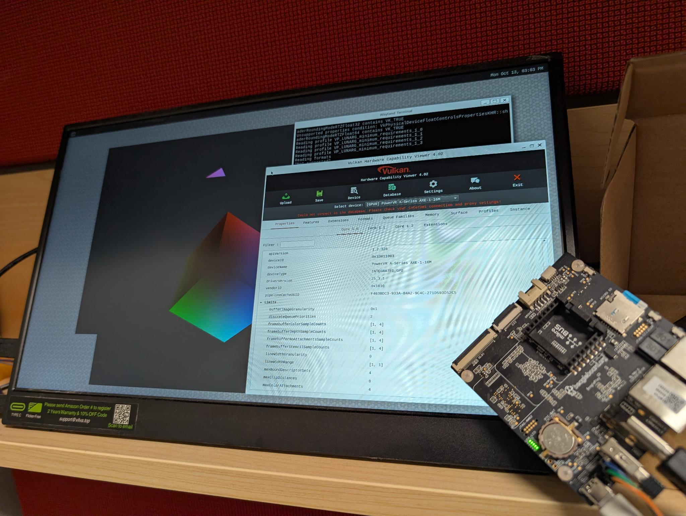

# poky-imagination
Let us see what it takes to get Poky working with upstream imagination for AM62x

This is a collection of kas yml files used to demonstrate if we can
get upstream kernel, Mesa, zink etc working out of pure poky for
IMAGINATION GPUs on AM62x (AXE).

# Status:

As of:

```yaml
header:
    version: 14
overrides:
    repos:
        bitbake:
            commit: f23e186a75e71ba885b9b53a1dfda99af29c67b0
        openembedded-core:
            commit: 235e6d49e5888ad04416219e10b6df91a738661a
        meta-yocto:
            commit: e1363aa3333cda3a4ae4706ce6577b987ba3a815
        meta-openembedded:
            commit: 254f1285e8332f9c81bf1441f0098b0de4d2d745
        meta-qt5:
            commit: 9d9966d81d6a98876f3919127ece3a6829edf609
        meta-vulkan:
            commit: 038b4c7a29d11cb546aa7ffb963b4875a7677771
```

| Device    | Board       | Hardware IP | Status   | Status Date |
| --------- | ----------- | ------------| -------- | ----------- |
| AM62x     | BeaglePlay  | AXE         | Mostly(pending zink)       | 2026-01-08 |

* vkcube works on weston image on BeaglePlay (see below)
* vkmark had build issues (unrelated, some vulkan header mismatch)
* zink support pending, so weston still uses s/w for compositing



# Kas config Files:

Pure poky:

* **poky-generic-arm64-min.yml** - minimal genericarm64 build
* **poky-generic-arm64-full-cmd.yml** - full command line genericarm64 build

We would like these to work (GUI):

* **poky-generic-arm64-sato.yml** - sato build with X11 (and attempt at enabling imagination components)
* **poky-generic-arm64-weston.yml** - weston build (and attempt at enabling imagination components)
* **poky-generic-arm64-xfce.yml** - XFCE build (and attempt at enabling imagination components)

# Additional KAS configuration files

* **cloud-utils-growpart.yml** - Add to the list of yml to allow resulting image to resize sdcard to fill up the sd card on the very first boot.
* **vulkan-examples.yml** - Adds some basic vulkan utilities to build with weston - NOTE: vkmark build is broken, so not enabled.. vkcube etc works. (use with poky-generic-arm64-weston.yml)
* **enable-powervr-weston.yml** - Add this so that we do not need to manually edit /etc/default/weston with PVR_I_WANT_A_BROKEN_VULKAN_DRIVER=1
* **pokyuser.yml** - Adds a normal user called "pokyuser" instead of just root user.
* **image.yml** - Generate a wic and tar output
* **caches.yml** - Uses a caches path for sstate and downloads etc.

# BeaglePlay steps:

* Update the board with https://rcn-ee.net/rootfs/debian-arm64-12-bookworm-xfce-v6.12-ti/2025-03-05/beagleplay-emmc-flasher-debian-12.9-xfce-arm64-2025-03-05-12gb.img.xz (in bootloader in emmc) or newer image
* Build the corresponding kas configuration file (``kas build poky-generic-arm64-weston.yml:enable-powervr-weston.yml:vulkan-examples.yml:caches.yml:image.yml:pokyuser.yml:cloud-utils-growpart.yml``)
* just flash the wic image in ```build/tmp/deploy/images/genericarm64``` to sdcard.
* Modify /etc/default/weston on sdcard as follows:
```
root/etc/default/weston -> add PVR_I_WANT_A_BROKEN_VULKAN_DRIVER=1
```

Just put the sdcard, hdmi, keyboard etc, and power on, the board will automatically
boot from the sdcard. No need to press any buttons.

# Building:

Simplest build is this:

```
kas-build.sh -e "kas build poky-generic-arm64-min.yml"
```

Let us say, you would like a rootfs as well, and a compressed wic image (unlike the default poky), then:

```
kas-build.sh -e "kas build poky-generic-arm64-min.ymlmage.yml:image.yml"
```

And to add to that, build on a with a sstate and download folder:

* /OE is where sstate and download folders are located - different drive for OE builds.
* build and workdir is on /OE/build-poky

```
kas-build.sh -e "kas build poky-generic-arm64-min.yml:caches.yml:image.yml" -c /OE -w /OE/build-poky
```
